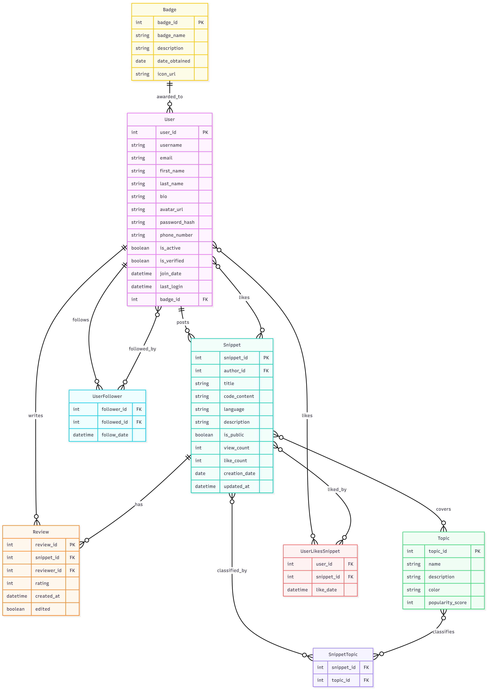

# 💻 Cubicle - Réseau Social de Partage de Snippets de Code

[](https://github.com/Elyes5/DDA_SADDEM_Elyes_PROJET_INFO3.git)

## 1. Contexte du Projet

Ce projet, **Cubicle**, est une application web dont l'objectif est de fournir une **API RESTful** pour un réseau social spécialisé dans le **partage et la revue de petits blocs de code (snippets)**.

L'application vise à formaliser les échanges entre développeurs en permettant de poster des snippets, de les classer par **sujet d'expertise (topic)**, de les commenter (revues par les pairs), de **liker** et de suivre les autres contributeurs.

---

## 2. Architecture Technique et Stack

L'application est conçue selon une architecture modulaire et conteneurisée.

* **Backend/API RESTful** : Développé en **Java/Spring Boot**.
* **Base de Données** : **PostgreSQL (PSQL)** (base de données relationnelle obligatoire) ou GraphQL potentiellement (choix pas encore réalisé).
* **ORM** : Utilisation d'**Hibernate/JPA** via **Spring Data JPA**.
* **Conteneurisation** : L'ensemble des services est conteneurisé avec **Docker** et orchestré via **Docker Compose**.
---

## 3. Comment Lancer l'Application (Docker Compose)

Pour lancer l'application, assurez-vous d'avoir Docker et Docker Compose installés. Les parties 2 et 3 seront réalisées lors de la phase de développement.

1.  **Cloner le dépôt :**
    ```bash
    git clone https://github.com/Elyes5/DDA_SADDEM_Elyes_PROJET_INFO3.git
    cd cubicle
    ```

2.  **Lancer les services :**
    Exécutez la commande suivante à la racine du projet :
    ```bash
    docker-compose up --build -d
    ```
    *(Cette commande construit l'image du serveur, démarre le serveur et le conteneur PostgreSQL (ou GraphQL).)*

3.  **Vérification :**
    Les APIs devraient être accessibles à l'adresse suivante : `http://localhost:8080/api/` (ou le port que vous avez configuré).

---

## 4. Publication de l'Image Docker (non réalisée pour l'instant)

L'image Docker du backend sera publiée sur Docker Hub.

---

## 5. Modélisation des Données et Relations

Le schéma de base de données est structuré pour répondre aux exigences de la SAE concernant les trois types de relations obligatoires.

| Entités | Type de Relation | Explication | Contrainte SAE |
| :--- | :--- | :--- | :--- |
| **User** $\leftrightarrow$ **Badge** | **One-to-One** | Chaque utilisateur a un statut/profil unique (métadonnées utilisateur). | **One-to-One** |
| **Snippet** $\leftrightarrow$ **Review** | **One-to-Many** | Un snippet reçoit plusieurs revues/commentaires. | **One-to-Many**|
| **User** $\leftrightarrow$ **User** (Follower) | **Many-to-Many** | Un utilisateur suit plusieurs personnes, et est suivi par plusieurs (relation récursive). | **Many-to-Many** |
| **Snippet** $\leftrightarrow$ **Topic** | **Many-to-Many** | Un snippet peut être associé à plusieurs sujets d'expertise. | **Many-to-Many** |
| **User** $\leftrightarrow$ **Snippet** (Likes) | **Many-to-Many** | Un utilisateur peut liker plusieurs snippets, et un snippet peut être liké par plusieurs utilisateurs. | **Many-to-Many** |

Voici le diagramme résultant:

<div align="center">
  
</div>


## 6. Exemples de Routes API REST (Interface et Démonstration)

L'API utilise les verbes HTTP standards (GET, POST, PUT/PATCH, DELETE). Ces APIs ne sont pas finales et peuvent être étendues selon le besoin.

### 1. Gestion des Utilisateurs (`/api/users`)

| Méthode HTTP | Route (URL) | Description | Démonstration |
| :--- | :--- | :--- | :--- |
| `POST` | `/api/users` | Crée un nouvel utilisateur. | CRUD de base |
| `GET` | `/api/users/{user_id}/badge` | Récupère le badge de l'utilisateur. | **One-to-One** |
| `GET` | `/api/users/{user_id}/followers` | Liste les utilisateurs qui suivent cet utilisateur. | **Many-to-Many** |
| `POST` | `/api/users/{user_id}/follow` | Permet à l'utilisateur actuel de suivre un autre utilisateur. | **Many-to-Many** |

### 2. Gestion des Snippets, Revues et Likes (`/api/snippets`)

| Méthode HTTP | Route (URL) | Description | Démonstration |
| :--- | :--- | :--- | :--- |
| `POST` | `/api/snippets` | Crée et publie un nouveau snippet. | CRUD de base |
| `GET` | `/api/snippets?topic=sécurité` | Récupère la liste des snippets, filtrable par sujet. | Requête filtrée |
| `GET` | `/api/snippets/{snippet_id}` | Récupère les détails complets d'un snippet. | CRUD de base |
| `POST` | **`/api/snippets/{snippet_id}/likes`** | Ajoute un "like" au snippet. | **Many-to-Many (Like)** |
| `DELETE` | **`/api/snippets/{snippet_id}/likes`** | Retire le "like" du snippet. | **Many-to-Many (Like)** |
| `POST` | `/api/snippets/{snippet_id}/reviews` | Ajoute une revue/note à un snippet. | **One-to-Many** |
| `GET` | `/api/snippets/{snippet_id}/reviews` | Liste toutes les revues pour un snippet donné. | **One-to-Many** |
| `PUT/PATCH` | `/api/snippets/{snippet_id}` | Met à jour le contenu du snippet. | CRUD de base |
| `DELETE` | `/api/snippets/{snippet_id}` | Supprime un snippet. | CRUD de base |

### 3. Gestion des Sujets (Topics) (Classification)

| Méthode HTTP | Route (URL) | Description | Démonstration |
| :--- | :--- | :--- | :--- |
| `GET` | `/api/topics/{topic_id}/snippets` | Liste tous les snippets associés à ce sujet. | **Many-to-Many** |
| `POST` | `/api/snippets/{snippet_id}/topics` | Associe un sujet supplémentaire à un snippet. | **Many-to-Many** |
